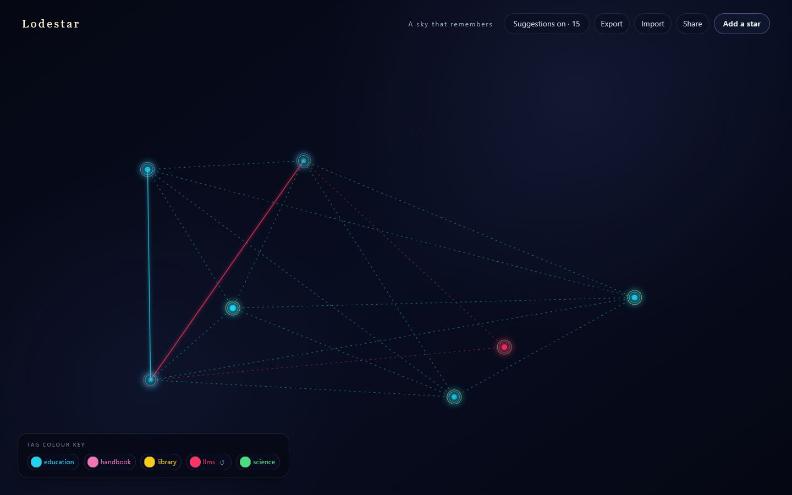

# Lodestar

A quiet, personal night sky for the things that struck you. Add a repository,
question, link, or thought; place it among your stars; then draw and name the
constellations that matter to you.

[Open Lodestar](https://purysho.github.io/lodestar/)

> The sky lives entirely in your browser. Lodestar has no accounts, backend,
> tracking, external data calls, or secrets.



## Quick start

```bash
git clone https://github.com/purysho/lodestar.git
cd lodestar
npm install && npm run dev
```

Open the local URL printed by Vite. Node 20 and npm are recommended.

## What the sky can do

- Add stars with a title, one-line note, tags, and an optional link.
- Drag stars anywhere; normalized positions survive reloads and screen sizes.
- Connect stars with a keyboard-friendly click-click flow. Clicking is used for
  drawing so dragging remains reserved for movement.
- Name, extend, rename, disconnect, and delete authored constellations.
- See faint dotted suggestions when two stars share an exact tag. Suggestions
  are derived at runtime and are never saved; accepting one creates an ordinary
  two-star constellation.
- Export or replace the whole sky with a versioned JSON file.
- Create an encoded share link. Links are capped at roughly 8 KB; larger skies
  should use JSON export. Opening a link asks before replacing local data.

## A sky that remembers

Bookmarks collect. Lodestar asks you to arrange. The machine may surface a
possibility, but only you turn it into a solid line and give it a name. Saved
data therefore contains only stars and user-authored constellations—never
recomputable suggestions.

The persistence schema carries a `schemaVersion`, loads through ordered
migrations, and writes the complete sky atomically to `localStorage`. JSON
export/import is the portability path; nothing is synchronized elsewhere.

## The trilogy

Lodestar is the memory layer for two stateless discovery projects:

- [GitHub Treasure Hunt](https://purysho.github.io/github-treasure-hunt/) finds
  open-source repositories worth wandering into.
- [The Open Questions Atlas](https://purysho.github.io/open-question-atlas/)
  surfaces questions humanity has not answered.
- Lodestar remembers what stayed with you.

### Send to sky

The handoff is live. Both discovery tools have a **Send to sky** / **Add to
sky** button that opens Lodestar with the item pre-loaded as a star. Because the
three sites live on separate GitHub Pages origins and cannot share
`localStorage`, the item travels **through the URL**: the sender encodes a small
payload into the hash (`…/lodestar/#/add?s=<encoded>`), and Lodestar reads it on
boot, validates and sanitizes it (untrusted input), assigns the star its `id`,
position, and `createdAt`, dedupes against what you already have, and lands it —
then strips the payload from the address bar. The `origin` field records where
each star came from (`treasure-hunt`, `atlas`, or `manual`).

The shared payload + encoding contract lives in
[`src/lib/starLink.js`](src/lib/starLink.js) and is mirrored verbatim in both
senders; a round-trip test on each side keeps them in lockstep. No backend, no
shared storage — the URL is the entire wire.

## Engineering notes

The interface is a static Vite + React + Tailwind site deployed from `main` by
GitHub Pages. The sky uses SVG because its focusable targets and event model are
a strong fit for small, accessible personal skies. If skies grow to thousands
of stars, the rendering layer can move to canvas while the normalized,
versioned saved model remains unchanged; canvas hit testing is deliberately not
part of this MVP.

Run every local gate with:

```bash
npm test
npm run lint
npm run build
```

## License

[MIT](LICENSE)
